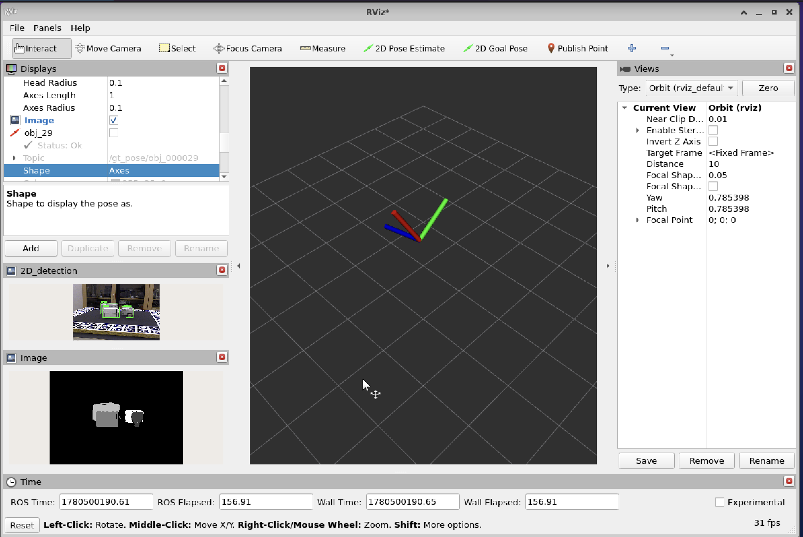

# perception_pipeline

ROS 2 package for 6DoF object pose estimation targeting robotic manipulation with the T-LESS BOP dataset. The pipeline uses ground-truth 2D bounding boxes as a development scaffold while pose estimation is built out, with a fine-tuned 2D detector as a final integration step.

## Pipeline

1. **2D detection** — ground-truth bboxes from T-LESS (`/gt_detections`) stand in during development; a fine-tuned YOLO model replaces this last
2. **Point localization** — back-projects each detection centroid to 3D using depth + camera intrinsics
3. **Coarse alignment (FPFH + RANSAC)** — estimates a full 6DoF initial pose including rotation by matching Fast Point Feature Histogram descriptors between the scene point cloud and the CAD model; prevents ICP from getting stuck in local minima
4. **ICP** — refines the coarse pose to a full 6DoF pose by aligning object CAD models against the depth point cloud
5. **Detector fine-tuning + TensorRT export** — train YOLO on T-LESS, export to TensorRT for deployment

## Status

- [x] T-LESS BOP dataset download + ROS 2 bag conversion (`scripts/bop_to_rosbag.py`), including ground-truth bounding boxes, per-object poses, and instance segmentation masks
- [x] Ground-truth bbox viz node (`src/bbox_viz_node.cpp`) — overlays bboxes on RGB for visual validation
- [x] RViz visualization config
- [x] Point localization node (`src/point_localization_node.cpp`) — back-projects detection centroids to 3D using depth + camera intrinsics
- [x] Coarse alignment (FPFH + RANSAC) in `src/icp_node.cpp` — full 6DoF initial pose estimate before ICP
- [x] ICP pose refinement against T-LESS CAD models
- [ ] Evaluation against ground-truth poses
- [ ] YOLO fine-tuning on T-LESS + TensorRT export

## Requirements

- Ubuntu 22.04, ROS 2 Humble
- C++17
- ONNX Runtime 1.20.1 (aarch64)

## Installation

### 1. Clone

```bash
mkdir -p ~/ros2_ws/src && cd ~/ros2_ws/src
git clone https://github.com/anramz29/perception_pipeline.git
```

### 2. ROS 2 dependencies

```bash
sudo apt update && sudo apt install \
  ros-humble-cv-bridge \
  ros-humble-sensor-msgs \
  ros-humble-geometry-msgs \
  ros-humble-vision-msgs \
  ros-humble-message-filters
```

### 3. ONNX Runtime

Download `onnxruntime-linux-aarch64-1.20.1.tgz` from the [ONNX Runtime releases](https://github.com/microsoft/onnxruntime/releases) and install to `/usr/local`:

```bash
tar xzf onnxruntime-linux-aarch64-1.20.1.tgz
sudo cp -r onnxruntime-linux-aarch64-1.20.1/include/* /usr/local/include/
sudo cp -r onnxruntime-linux-aarch64-1.20.1/lib/*     /usr/local/lib/
sudo ldconfig
```

### 4. Build

```bash
cd ~/ros2_ws && colcon build --packages-select perception_pipeline
source install/setup.bash
```

## Dataset Setup

Utility scripts require Python 3 with `huggingface_hub`. Downloads ~860 MB of [T-LESS](https://bop.felk.cvut.cz/datasets/) (CC BY 4.0).

```bash
pip3 install huggingface_hub rosbags
python3 scripts/download_bop.py   # download + extract T-LESS
python3 scripts/bop_to_rosbag.py  # convert to ROS 2 bag
```

`bop_to_rosbag.py` converts a T-LESS scene into a ROS 2 bag with RGB, depth, camera info, per-object ground-truth poses, `/gt_detections` (perfect 2D bounding boxes used in place of a trained detector during development), and `/gt_instance_mask` (a `mono16` label image where each visible instance is assigned a unique integer label; 0 = background).

The script takes three required arguments:

| Argument | Type | Description |
|---|---|---|
| `--scene` | int | Scene number (e.g. `1` maps to `test_primesense/000001`) |
| `--obj_id` | int | Target object ID to track (e.g. `25`) |
| `--bag_name` | str | Output bag name written to `data/bags/` |

```bash
python3 scripts/bop_to_rosbag.py --scene 1 --obj_id 25 --bag_name tless_scene1
```

If the object is not present in the scene, the script will warn and produce an empty bag rather than silently failing.

## Running

### Point localization pipeline

Plays the bag, runs the ground-truth bbox viz node, and runs the point localization node:

```bash
ros2 launch perception_pipeline pose_estimation.launch.py
```

Override the bag path:

```bash
ros2 launch perception_pipeline pose_estimation.launch.py \
  bag_path:=/path/to/bag
```

Monitor estimated positions with `ros2 topic echo /estimated_pose`.

### Pose refinement pipeline (FPFH + RANSAC → ICP)

Plays the bag and runs the full coarse-to-fine pose estimation pipeline:

```bash
ros2 launch perception_pipeline pose_refinement.launch.py
```

Override the bag path or CAD model:

```bash
ros2 launch perception_pipeline pose_refinement.launch.py \
  bag_path:=/path/to/bag \
  model_path:=/path/to/obj.ply
```

Monitor refined poses with `ros2 topic echo /refined_pose`. Position and rotation errors against ground truth are logged by the node.



### Ground-truth bbox visualizer

```bash
ros2 launch perception_pipeline detect_viz.launch.py
```

## Topics

| Topic | Type | Description |
|---|---|---|
| `/camera/rgb/image_raw` | `sensor_msgs/Image` | Input RGB frames |
| `/camera/depth/image_raw` | `sensor_msgs/Image` | Input depth frames |
| `/camera/camera_info` | `sensor_msgs/CameraInfo` | Camera intrinsics |
| `/gt_pose/obj_<id>` | `geometry_msgs/PoseStamped` | Ground-truth pose per object |
| `/gt_detections` | `vision_msgs/Detection2DArray` | Ground-truth 2D bounding boxes — development scaffold |
| `/gt_detections_debug` | `sensor_msgs/Image` | RGB annotated with ground-truth bounding boxes |
| `/gt_instance_mask` | `sensor_msgs/Image` | `mono16` mask of only a certain object in this case obj_2 |
| `/estimated_pose` | `geometry_msgs/PoseStamped` | 3D position back-projected from depth (identity orientation until ICP) |
| `/refined_pose` | `geometry_msgs/PoseStamped` | Full 6DoF pose after FPFH coarse alignment + ICP refinement |

## Project Structure

```
perception_pipeline/
├── config/
│   ├── detector_params.yaml       # YOLO params — not active focus
│   └── tless_viz.rviz
├── data/                          # gitignored
│   ├── bags/
│   └── tless/
├── launch/
│   ├── detect_cpp.launch.py       # YOLO detector — not active focus
│   ├── detect_viz.launch.py       # ground-truth bbox viz + bag playback
│   └── pose_estimation.launch.py  # bbox viz + point localization + bag playback
├── models/
│   └── yolo11n.onnx               # gitignored — not active focus
├── scripts/
│   ├── download_bop.py
│   └── bop_to_rosbag.py
└── src/
    ├── detector_node.cpp           # YOLO11 via ONNX Runtime — not active focus
    ├── bbox_viz_node.cpp           # ground-truth bbox overlay
    ├── point_localization_node.cpp # back-projects detection centroids to 3D
    └── icp_node.cpp                # FPFH coarse alignment + ICP pose refinement
```
