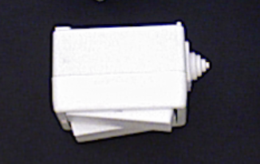

# perception_pipeline

ROS 2 package for 6DoF object pose estimation targeting robotic manipulation with the T-LESS BOP dataset. The pipeline uses ground-truth 2D bounding boxes as a development scaffold while pose estimation is built out, with a fine-tuned 2D detector as a final integration step.

## Pipeline

1. **2D detection** — ground-truth bboxes from T-LESS (`/gt_detections`) stand in during development; a fine-tuned YOLO model replaces this last
2. **Point localization** — back-projects each detection centroid to 3D using depth + camera intrinsics
3. **Multi-start ICP** — tries 24 rotation candidates (12 Z-axis steps × upright/flipped) at the known translation, runs fast ICP on each using downsampled clouds, picks the best fitness score, then runs a final full-resolution ICP refinement


## Status

- [x] T-LESS BOP dataset download + ROS 2 bag conversion (`scripts/bop_to_rosbag.py`), including ground-truth bounding boxes, per-object poses, and instance segmentation masks
- [x] Ground-truth bbox viz node (`src/bbox_viz_node.cpp`) — overlays bboxes on RGB for visual validation
- [x] RViz visualization config
- [x] Point localization node (`src/point_localization_node.cpp`) — back-projects detection centroids to 3D using depth + camera intrinsics
- [x] Multi-start ICP in `src/icp_node.cpp` — 12 Z-axis rotation candidates, downsampled scoring phase, full-resolution refinement
- [x] End-of-run summary statistics (pos error, rot error, timing)


## ICP Results

Best run on T-LESS scene 1, object 25 (43 frames):

| Metric | Mean | Min | Max |
|---|---|---|---|
| Position error | 0.0134 m | 0.0031 m | 0.0308 m |
| Rotation error | 117.35° | 11.79° | 179.24° |
| Processing time | 69.7 ms | 0.0 ms | 103.9 ms |

Position accuracy is solid (~1-3 cm), which validates the translation hint from point localization. Rotation accuracy is poor and effectively random — see the analysis below.

## ICP Analysis and Lessons Learned

### The object: T-LESS object 25



Object 25 is a white rectangular connector with a small asymmetric protrusion on one side. It is **not** rotationally symmetric — a correct solution should in principle be uniquely determinable from geometry alone. In practice, the uniform white surface means the depth image captures almost no discriminating structure: every face is a flat white plane, and the small protrusion is easily lost to depth noise or partial occlusion. The point cloud looks nearly identical from several orientations despite the object being technically asymmetric.

### Why rotation fails on T-LESS

Point-to-point ICP fitness scores (mean squared distance between nearest-neighbor pairs) cannot reliably distinguish correct from incorrect rotations on textureless objects. Even though object 25 is asymmetric, the depth-only scene cloud loses the geometric detail that would break the ambiguity — the protrusion may be only a few millimetres deep and is easily smoothed out at typical working distances. As a result:

- Many rotation candidates produce nearly identical fitness scores
- The best-scoring candidate is frequently not the geometrically correct one
- The final ICP refinement cannot recover from a bad starting rotation

The ~90° and ~180° error clusters are local minima that look plausible to the scorer, not true symmetry. This is the fundamental limitation of geometry-only ICP on this type of object, not a tuning problem.

### Strategies attempted

**Multi-start candidates** — Trying multiple rotation seeds before the final refinement is the standard approach to escape ICP local minima. We tried:
- 24 candidates: 12 Z-axis steps (30° apart) × 2 X-axis flips (0° and 180°)
- 24 candidates: cube symmetry group (6 face normals × 4 spins) for uniform SO(3) coverage

Neither improved rotation accuracy meaningfully. The scoring phase correctly finds the best candidate in the set, but the correct rotation is not reliably the best-scoring one on textureless geometry.

**Coarse-to-fine downsampling** — Fast ICP on coarse clouds (10 mm voxels) for candidate scoring, fine clouds (5 mm voxels) for the final refinement. This reduced processing time from ~250 ms to ~70 ms per frame without accuracy loss.

**Pre-computing the CAD downsample** — The CAD model is static, so downsampling once at startup (rather than every frame) eliminates redundant computation.

**Correspondence distance tuning** — The fast scoring phase uses 5 cm max correspondence distance to ensure bad candidates still find enough point pairs to produce a meaningful fitness score.

**Point-to-plane ICP** — Tested on a separate branch (`feature_point_to_plane`). Generated more "not enough correspondences" failures and higher per-frame compute with no rotation improvement. Normal estimation on a noisy depth-only cloud of a flat white surface produces unreliable normals, making the scoring noisier rather than more discriminative.

### What actually works for T-LESS

Geometry-only ICP is the wrong tool for this dataset. Learning-based methods that use rendered object templates or texture-free feature embeddings are the standard approach:

- **FoundationPose** — uses a neural network to score candidate poses against rendered templates and handles textureless objects well. However, FoundationPose requires a CUDA-capable GPU. This project is developed on a Mac M1 running a Linux VM — GPU passthrough to the guest OS is not supported on Apple Silicon, so CUDA is unavailable. FoundationPose integration is blocked until the pipeline runs on a machine with a discrete NVIDIA GPU.


## Requirements

- Ubuntu 22.04, ROS 2 Humble
- C++17
- ONNX Runtime 1.20.1 (aarch64)

## Installation

### 1. Clone

```bash
mkdir -p ~/ros2_ws/src && cd ~/ros2_ws/src
git clone https://github.com/anramz29/perception_pipeline.git
```

### 2. ROS 2 dependencies

```bash
sudo apt update && sudo apt install \
  ros-humble-cv-bridge \
  ros-humble-sensor-msgs \
  ros-humble-geometry-msgs \
  ros-humble-vision-msgs \
  ros-humble-message-filters
```

### 3. ONNX Runtime

Download `onnxruntime-linux-aarch64-1.20.1.tgz` from the [ONNX Runtime releases](https://github.com/microsoft/onnxruntime/releases) and install to `/usr/local`:

```bash
tar xzf onnxruntime-linux-aarch64-1.20.1.tgz
sudo cp -r onnxruntime-linux-aarch64-1.20.1/include/* /usr/local/include/
sudo cp -r onnxruntime-linux-aarch64-1.20.1/lib/*     /usr/local/lib/
sudo ldconfig
```

### 4. Build

```bash
cd ~/ros2_ws && colcon build --packages-select perception_pipeline --cmake-args -DCMAKE_BUILD_TYPE=Release
source install/setup.bash
```

## Dataset Setup

Utility scripts require Python 3 with `huggingface_hub`. Downloads ~860 MB of [T-LESS](https://bop.felk.cvut.cz/datasets/) (CC BY 4.0).

```bash
pip3 install huggingface_hub rosbags
python3 scripts/download_bop.py   # download + extract T-LESS
python3 scripts/bop_to_rosbag.py  # convert to ROS 2 bag
```

`bop_to_rosbag.py` converts a T-LESS scene into a ROS 2 bag with RGB, depth, camera info, per-object ground-truth poses, `/gt_detections` (perfect 2D bounding boxes used in place of a trained detector during development), and `/gt_instance_mask` (a `mono16` label image where each visible instance is assigned a unique integer label; 0 = background).

The script takes three required arguments:

| Argument | Type | Description |
|---|---|---|
| `--scene` | int | Scene number (e.g. `1` maps to `test_primesense/000001`) |
| `--obj_id` | int | Target object ID to track (e.g. `25`) |
| `--bag_name` | str | Output bag name written to `data/bags/` |

```bash
python3 scripts/bop_to_rosbag.py --scene 1 --obj_id 25 --bag_name tless_scene1
```

If the object is not present in the scene, the script will warn and produce an empty bag rather than silently failing.

## Running

### Point localization pipeline

Plays the bag, runs the ground-truth bbox viz node, and runs the point localization node:

```bash
ros2 launch perception_pipeline pose_estimation.launch.py
```

Override the bag path:

```bash
ros2 launch perception_pipeline pose_estimation.launch.py \
  bag_path:=/path/to/bag
```

Monitor estimated positions with `ros2 topic echo /estimated_pose`.

### Pose refinement pipeline (multi-start ICP)

Plays the bag and runs the full coarse-to-fine pose estimation pipeline:

```bash
ros2 launch perception_pipeline pose_refinement.launch.py
```

Override the bag path or CAD model:

```bash
ros2 launch perception_pipeline pose_refinement.launch.py \
  bag_path:=/path/to/bag \
  model_path:=/path/to/obj.ply
```

Monitor refined poses with `ros2 topic echo /refined_pose`. Position and rotation errors against ground truth are logged by the node.


### Ground-truth bbox visualizer

```bash
ros2 launch perception_pipeline detect_viz.launch.py
```

## Topics

| Topic | Type | Description |
|---|---|---|
| `/camera/rgb/image_raw` | `sensor_msgs/Image` | Input RGB frames |
| `/camera/depth/image_raw` | `sensor_msgs/Image` | Input depth frames |
| `/camera/camera_info` | `sensor_msgs/CameraInfo` | Camera intrinsics |
| `/gt_pose/obj_<id>` | `geometry_msgs/PoseStamped` | Ground-truth pose per object |
| `/gt_detections` | `vision_msgs/Detection2DArray` | Ground-truth 2D bounding boxes — development scaffold |
| `/gt_detections_debug` | `sensor_msgs/Image` | RGB annotated with ground-truth bounding boxes |
| `/gt_instance_mask` | `sensor_msgs/Image` | `mono16` mask of only a certain object in this case obj_2 |
| `/estimated_pose` | `geometry_msgs/PoseStamped` | 3D position back-projected from depth (identity orientation until ICP) |
| `/refined_pose` | `geometry_msgs/PoseStamped` | Full 6DoF pose after multi-start ICP refinement |

## Project Structure

```
perception_pipeline/
├── config/
│   ├── detector_params.yaml       # YOLO params — not active focus
│   └── tless_viz.rviz
├── data/                          # gitignored
│   ├── bags/
│   └── tless/
├── launch/
│   ├── detect_cpp.launch.py       # YOLO detector — not active focus
│   ├── detect_viz.launch.py       # ground-truth bbox viz + bag playback
│   └── pose_estimation.launch.py  # bbox viz + point localization + bag playback
├── models/
│   └── yolo11n.onnx               # gitignored — not active focus
├── scripts/
│   ├── download_bop.py
│   └── bop_to_rosbag.py
└── src/
    ├── detector_node.cpp           # YOLO11 via ONNX Runtime — not active focus
    ├── bbox_viz_node.cpp           # ground-truth bbox overlay
    ├── point_localization_node.cpp # back-projects detection centroids to 3D
    └── icp_node.cpp                # multi-start ICP pose refinement
```
